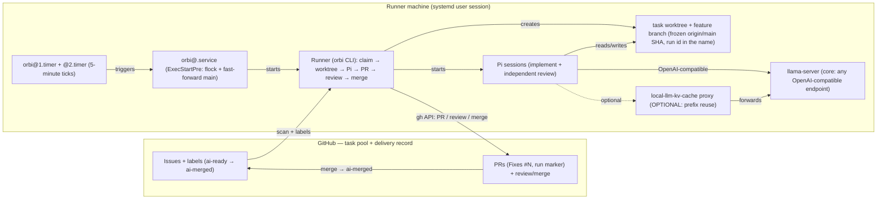

# Orbi

Orbi turns a GitHub Issue into a tested, independently reviewed, and merged pull request.

Orbi is a local AI development worker. You put work into GitHub Issues; it automatically claims an `ai-ready` Issue, develops it in an isolated worktree, runs the real test suite, opens a PR, then completes an independent review (with in-session fixes) and merges a clean PR — with the whole delivery recorded in GitHub Issues, comments and the PR itself. The reviewing session can run on a **different model** than the implementing session ([learn how](/workflow#reviewing-with-a-different-model)). This MVP keeps state only in GitHub rather than a database or queue, runs one Issue per tick rather than a daemon, and does not discover repositories or push to protected branches itself. See [/security](/security) for the full boundary list.

## What makes it different

<CardGroup>
  <Card title="GitHub is the whole ledger" href="/workflow">
    Issues, labels, comments and the PR are the complete delivery record. Orbi uses no database or second task system.
  </Card>
  <Card title="Independent review, optionally on a different model" href="/workflow#reviewing-with-a-different-model">
    A second session that did not write the code reviews the PR and fixes findings in-session. `review_pi_*` lets that session run on another model.
  </Card>
  <Card title="You can steer a running delivery" href="/operations#event-reference">
    A trusted correction on the Issue restarts the run with it.
  </Card>
  <Card title="Releases are deliveries too" href="/workflow#epics-release-tasks-and-p0-priority">
    A Release task runs the release state machine: CI wait, tag, and notes. Release work follows the same GitHub delivery record.
  </Card>
  <Card title="Self-hosted core, hosted control plane" href="/installation">
    The runner is open source and runs on your machine. [Orbi Managed Cloud](https://orbi.build/cloud/?ref=docs-index) runs the same ledger without you operating a runner.
  </Card>
</CardGroup>

## How it works

## Where to go next

- [Quickstart](/quickstart): create and deliver your first Issue.
- [Ways to run Orbi](/installation): self-host the runner or use Managed Cloud.
- [Workflow](/workflow): the Issue → PR → review → merge chain.
- [Operations](/operations): timers, logs, CLI, worktrees and recovery.
- [Security](/security): delivery boundaries and protected-branch safeguards.
