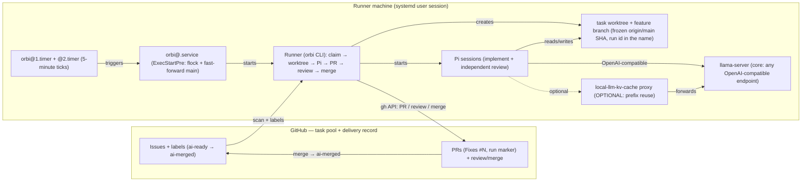

# Orbi

Orbi is a local AI development worker. You put work into GitHub
Issues; it automatically claims an `ai-ready` Issue, develops it in an
isolated worktree, runs the real test suite, opens a PR, then completes an
independent review (with in-session fixes) and merges a clean PR — with the
whole delivery recorded in GitHub Issues, comments and the PR itself.

## System architecture overview

The solid arrow `Pi → llama-server` is the core path (any
OpenAI-compatible endpoint works). The dotted arrow marks the optional
[`local-llm-kv-cache`](/optional-kv-cache) proxy: it only adds faster
prefix reuse for local llama.cpp models and is never a core
prerequisite.

## The problem it solves

Small and medium development tasks (a bug, a feature, a docs change, a
workflow fix) usually follow the same loop: read the context, plan,
implement, test, open a PR, review, fix, merge. Orbi runs that loop
locally and unattended:

- **GitHub Issues are the task pool.** No Web Kanban, no database, no
  second task system — the Issue, its labels, its comments and its PR are
  the complete delivery record.
- **Pi is the developer.** Each task runs one full Pi session (plan →
  implement → test → verify → PR) in an isolated git worktree; a second,
  independent Pi session reviews the PR and fixes findings in-session.
- **The Runner is the thin connector.** A small Python process (`gh` +
  `git` + `pi` + `systemd`) claims Issues, holds the delivery to merge,
  publishes progress, and recovers from restarts. It never implements
  business logic itself.

## When to use it

- You have a GitHub repository (or a small fixed set of repositories) and
  want tasks to be picked up and delivered as PRs overnight or unattended.
- You want the delivery evidence (plan, tests, review verdict, PR) to live
  in GitHub, not in a private tool.
- You run your own model endpoint (a local llama.cpp server or any
  OpenAI-compatible API) that can serve a coding agent stably.

## MVP boundary

Orbi is intentionally an MVP. The boundary is part of the design:

- GitHub Issues and labels are the **only** state store — no database, no
  message queue, no web UI.
- The Python Runner is **not a daemon**: a systemd user timer triggers one
  tick every 5 minutes; each tick processes at most one Issue (or resumes
  one opened PR) and exits.
- No task DAG, no multi-agent parallelism, no risk model, no policy
  engine, no fallback path — a command error fails fast and leaves the
  scene in the journal and the Issue comment.
- No business task timeout: a slow model is not a failure. Only command
  errors, an unavailable environment, or an unresolvable review fail fast.

What it does **not** do: it does not discover repositories, it does not
merge or push protected branches itself (the Runner is the only merge
actor, and only through a reviewed PR), and it does not run without a
working model endpoint.

## Where to go next

- [Getting started](/getting-started): prerequisites, configuration, first
  start and a from-zero smoke walkthrough.
- [Workflow](/workflow): the complete Issue → PR → review → merge chain,
  labels, run markers, Epics, Release tasks and P0 priority.
- [Operations](/operations): timer, logs, CLI, worktrees and failure
  recovery.
- [Security](/security): the boundaries that keep the AI from touching
  protected branches or leaking secrets.
