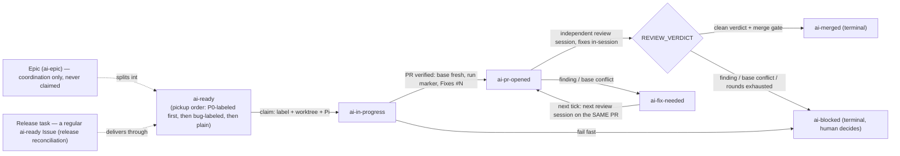

# Workflow

One Muyan Pilot task is one runtime outcome: when X, should Y, actually Z.
A task starts as a GitHub Issue and ends as a merged PR (or an
`ai-blocked` scene that needs a human). This page covers the complete
automatic chain and the project's GitHub workflow vocabulary.

## The complete chain

State machine (the six delivery states; the review/fix loop stays on the
same PR — only its head may advance):



```text
ai-ready                a task is dispatched (muyan_pilot.py add, or a human
                        adds the label)
  -> ai-in-progress     the Runner claims it: label added, worktree created
                        from the frozen origin/<base> SHA, Pi session starts
  -> ai-pr-opened       the PR passes verification (base freshness, run
                        marker, Fixes #N); the delivery now awaits review
  -> review             an independent Pi session reviews the exact
                        base/head SHAs and FIXES findings in-session
                        (code, full test suite, 100% coverage, push only
                        the task branch), then emits a REVIEW_VERDICT
  -> ai-fix-needed      a finding could not be fixed in-session, or the PR
                        is behind the latest base / has a merge conflict:
                        the NEXT tick starts the next review session on
                        the same run, same branch, same PR
  -> merge              clean verdict + merge gate (head contains the
                        latest base, PR mergeable, remote head unchanged)
  -> ai-merged          success terminal state; the PR body's Fixes #N
                        closes the Issue natively
```

Failure at any point fails fast: the Issue is marked `ai-blocked` with the
concrete scene (command, return code, stdout/stderr, branch, worktree,
session file), and the automatic loop never touches it again — a human
decides the next step.

Rules of the chain:

- One task = one run = one feature branch = one worktree = one PR. The PR
  number never changes during the review/fix loop; only its head may
  advance.
- Only the two opened-PR states are picked up automatically:
  `ai-pr-opened` (awaiting review) and `ai-fix-needed` (awaiting the next
  review session). `ai-ready` is claimed as new work; `ai-blocked` is
  never auto-recovered.
- The review/fix loop is bounded (5 rounds). Exhausting rounds with
  findings, or a review that cannot be verified, marks the Issue
  `ai-blocked`; the PR, branch and worktree stay intact.
- Base advances are absorbed by a plain `git merge` of the latest
  `origin/<base>` on the task branch (conflicts resolved manually),
  followed by a full test rerun. No force push, no auto conflict
  resolution, no push of the protected branch.
- Git transport (Issue #114): git data operations (fetch, push —
  including `.github/workflows/*.yml`) go over SSH
  (`git@github.com:owner/repo.git`); GitHub API operations (Issue, PR,
  label, comment, merge) stay on the `gh` token. The task worktree
  inherits the deployment checkout's single `origin` remote, so a new
  bootstrap worktree has an SSH `git remote -v` by construction; a
  broken transport fails the pre-start check (no HTTPS fallback).

## Delivery labels

GitHub labels are the external state machine. They are not created by
commits — initialize them per repository (see
[Getting started](/getting-started)):

| Label | Meaning |
|---|---|
| `ai-ready` | Explicitly dispatched to the Pilot; may be claimed |
| `ai-in-progress` | Claimed and running (a leftover after a kill is resumed by the next tick) |
| `ai-pr-opened` | PR created and verified; awaiting the independent review |
| `ai-fix-needed` | The PR head is not mergeable yet; the next tick runs the next review session on the same PR |
| `ai-merged` | Success terminal state; the Runner merged the PR and confirmed the merge commit on the protected branch |
| `ai-blocked` | The Runner failed fast; a human must decide the next step |

## Run marker and run_id

Every task attempt generates one `run_id` (8 hex chars, e.g.
`e07383c2`) and reuses it for every step of the attempt; a retry of the
same Issue generates a new one. The same id appears in:

- every journal line of the attempt (prefix `[e07383c2]`);
- the Issue/PR comments: visible field `run_id=e07383c2` plus the hidden
  machine-readable marker `<!-- muyan-pilot:run=e07383c2 -->`;
- the feature branch and worktree name
  (`.worktrees/<...>-issue-<n>-e07383c2`);
- the PR body — the stable marker `<!-- muyan-pilot:run=e07383c2 -->` is
  part of the PR contract; the Runner rejects a PR without it.

Reconstruct a full timeline with one grep:

```bash
journalctl --user -u muyan-pilot.service | grep e07383c2
gh search issues "e07383c2" --repo OWNER/PILOT-REPO
```

## PR body contract: `Fixes #N`

The PR description must contain `Fixes #<issue-number>` (it may be on the
first line). GitHub reads the body (not the PR title) and closes the Issue
natively when the PR merges into the default branch. The Runner verifies
the keyword during PR acceptance and fails fast when it is missing.

## Epics, Release tasks and P0 priority

The project organizes multi-task work with plain GitHub primitives — no
DAG, no priority numbers, no separate queues:

- **Epic**: a coordination Issue that groups a set of related tasks (for
  example the v0.1 release checklist). It is marked with the `ai-epic`
  label. An Epic is not itself a directly executable task: the actual
  work is split into independent `ai-ready` Issues, each with one runtime
  outcome, one PR, one review and one merge. The Epic is closed only
  after its sub-Issues are done and the release evidence exists on the
  remote (tag, merged PRs) — typically with a final `Fixes #<epic>`
  commit/PR.
- **Release task**: a regular `ai-ready` Issue whose job is release
  reconciliation — checking that the sub-Issues are merged, the version
  tag exists on the remote, and the release evidence is complete. Like
  any task it delivers through one PR (or closes the Epic when the
  evidence is already on the remote).
- **P0 priority**: the plain `p0` GitHub label marks an urgent Issue
  (a production outage). It is NOT a delivery state — it only orders the
  ready pickup, never changes the Issue granularity, any delivery state,
  or the terminal-state semantics, and the Runner never adds or removes
  it. The ready pickup order is fixed: `ai-ready`+`p0` →
  `ai-ready`+`bug` → plain `ai-ready` (three `gh issue list` scans
  sharing the exact same exclusions and blockedBy semantics). P0 obeys
  every existing exclusion rule and the single-slot constraint: a
  blocked P0 is skipped (falling back to the bug/plain scans) and an
  in-flight P0 is resumed by the restart scan. A failed P0 run enters
  `ai-blocked` ALONE (the claim label is removed; the `ai-ready`
  residue is excluded by every ready scan), so no tick re-claims it —
  no infinite retry. There is no priority number or weighted queue.

Task dependencies between Issues use GitHub's native `blockedBy`
relation (`gh issue edit N --add-blocked-by M`); the Runner reads the
field and skips Issues with open blockers. `Depends on #N` lines in an
Issue body are not parsed.
