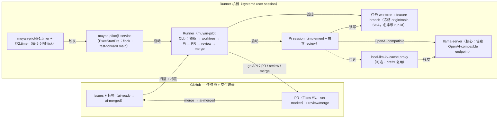

# Muyan Pilot

Muyan Pilot 是一个本地 AI 开发 Worker：把任务放进 GitHub Issue，它自动领取
`ai-ready` Issue，在隔离 worktree 中开发、运行真实测试套件、创建 PR，随后
完成独立审查（会话内修复）并合并干净的 PR——整个交付过程记录在 GitHub
Issue、评论和 PR 本身中。

## 系统架构总览

实线 `Pi → llama-server` 是核心链路（任意 OpenAI-compatible endpoint
都可以）。虚线标记可选的 [local-llm-kv-cache](/zh/optional-kv-cache)
proxy：它只为本地 llama.cpp 模型增加更快的 prefix 复用，**不是**核心
前提。

## 它解决的问题

中小型开发任务（bug、feature、文档修改、workflow 修复）通常走同一个
循环：读上下文、规划、实现、测试、开 PR、review、修复、合并。Muyan
Pilot 在本地无人值守地跑完这个循环：

- **GitHub Issue 就是任务池。** 没有 Web Kanban、没有数据库、没有第二套
  任务系统——Issue、它的标签、评论和 PR 就是完整的交付记录。
- **Pi 是开发者。** 每个任务运行一个完整 Pi session（plan → implement →
  test → verify → PR），在隔离的 git worktree 中；第二个独立的 Pi
  session 审查 PR 并在会话内修复 findings。
- **Runner 是薄连接器。** 一个小的 Python 进程（`gh` + `git` + `pi` +
  `systemd`）负责领取 Issue、把交付推到 merge、发布进度、从重启中恢复。
  它自己从不实现业务逻辑。

## 什么时候用它

- 你有一个 GitHub 仓库（或一小批固定仓库），希望任务在夜间或无人值守时
  被领取并交付为 PR。
- 你希望交付证据（plan、测试、review verdict、PR）留在 GitHub，而不是
  某个私有工具里。
- 你运行自己的模型 endpoint（本地 llama.cpp server 或任意
  OpenAI-compatible API），能稳定服务 coding agent。

## MVP 边界

Muyan Pilot 刻意是一个 MVP，边界是设计的一部分：

- GitHub Issue 和标签是**唯一**状态存储——没有数据库、没有消息队列、
  没有 Web UI。
- Python Runner **不是 daemon**：systemd user timer 每 5 分钟触发一个
  tick；每个 tick 最多处理一个 Issue（或恢复一个已打开的 PR）然后退出。
- 没有任务 DAG、没有多 Agent 并行、没有风险模型、没有 policy engine、
  没有 fallback 路径——命令错误立即失败（fail fast），现场留在 journal
  和 Issue 评论里。
- 没有业务任务 timeout：慢模型不是失败。只有命令错误、环境不可用、或
  无法解决的 review 才会 fail fast。

它**不**做的事：不自动发现仓库、不自己 merge 或 push 保护分支（Runner
是唯一 merge actor，且只通过已审查的 PR）、没有可用模型 endpoint 时
不运行。

## 下一步

- [快速开始](/zh/getting-started)：前提、配置、首次启动和从零 smoke
  walkthrough。
- [工作流](/zh/workflow)：完整的 Issue → PR → review → merge 链路、
  标签、run marker、Epic、Release task 和 P0 优先级。
- [运维](/zh/operations)：timer、日志、CLI、worktree 和故障恢复。
- [安全](/zh/security)：让 AI 碰不到保护分支、不泄漏密钥的边界。
