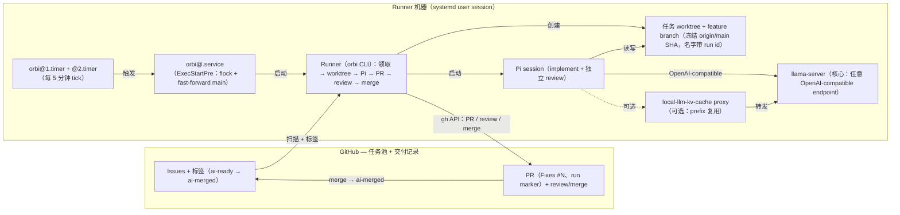

# Orbi

Orbi 会把 GitHub Issue 转化为经过测试、独立审查并合并的拉取请求。

Orbi 是一个本地 AI 开发 Worker：把任务放进 GitHub Issue，它自动领取 `ai-ready` Issue，在隔离 worktree 中开发、运行真实测试套件、创建 PR，随后完成独立审查（会话内修复）并合并干净的 PR——整个交付过程记录在 GitHub Issue、评论和 PR 本身中。审查会话可以使用与实现会话**不同的模型**（different model）（见[工作流](/zh/workflow)）。这个 MVP 只在 GitHub 中保存状态，而不是使用数据库或队列；每个 tick 运行一个 Issue，而不是 daemon；它不会自动发现仓库，也不会自行 push 保护分支。完整边界见[/zh/security](/zh/security)。

## 它有什么不同

<CardGroup>
  <Card title="GitHub 就是完整账本" href="/zh/workflow">
    Issue、标签、评论和 PR 构成完整的交付记录。Orbi 不使用数据库或第二套任务系统。
  </Card>
  <Card title="独立审查，也可以使用不同模型" href="/zh/workflow">
    没有编写代码的第二个会话会审查 PR，并在会话内修复 findings。`review_pi_*` 允许该会话使用另一个模型。
  </Card>
  <Card title="你可以 steer 正在运行的交付" href="/operations#event-reference">
    Issue 上可信任的修正会让运行重新带上这条修正。
  </Card>
  <Card title="Release 也是交付" href="/zh/workflow#epicrelease-task-与-p0-优先级">
    Release task 会运行发布状态机：等待 CI、打 tag 和写 notes。发布工作使用同一份 GitHub 交付记录。
  </Card>
  <Card title="自托管核心，托管控制平面" href="/zh/installation">
    Runner 是开源的，可以运行在你的机器上。[Orbi Managed Cloud](https://orbi.build/cloud/) 使用同一份账本运行，不需要你自己运维 Runner。
  </Card>
</CardGroup>

## 它如何工作

## 下一步

- [快速开始](/zh/quickstart)：创建并交付你的第一个 Issue。
- [运行 Orbi 的方式](/zh/installation)：自托管 Runner 或使用 Managed Cloud。
- [工作流](/zh/workflow)：Issue → PR → review → merge 链路。
- [运维](/zh/operations)：timer、日志、CLI、worktree 和故障恢复。
- [安全](/zh/security)：交付边界和保护分支安全措施。
