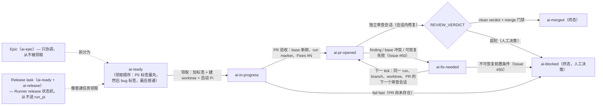

# 工作流

一个 Orbi 任务是一个 runtime outcome：当 X，应该 Y，实际 Z。
任务从一个 GitHub Issue 开始，以一个已合并的 PR 结束（或一个需要人工
的 `ai-blocked` 现场）。这一页覆盖完整的自动链路和项目的 GitHub 工作流
词汇。

## 完整链路

状态机（六个交付状态；review/fix 循环留在同一个 PR 上——只有它的 head
可以前进）：



```text
ai-ready                任务被派发（muyan-pilot add，或人工加标签）
  -> ai-in-progress     Runner 领取：加标签，从冻结的 origin/<base> SHA
                        创建 worktree，启动 Pi session
  -> ai-pr-opened       PR 验收通过（base 新鲜度、run marker、Fixes #N）；
                        交付现在等待 review
  -> review             独立 Pi session 审查精确的 base/head SHA，并
                        在会话内修复 findings（代码、完整测试、分层
                        覆盖率门禁（Issue #234）、只 push task
                        branch），然后输出 REVIEW_VERDICT
  -> ai-fix-needed      会话内未能修复 finding，PR 落后最新 base / 有
                        merge conflict，或已有 run/PR 的**可恢复失败**
                        （Issue #50：Pi 执行失败、验证失败、未推送本地
                        commit、worktree 缺失）：失败 comment 写入 Issue
                        和 PR，带完整现场（run_id、PR、branch、worktree、
                        session、phase、last activity、具体错误）；下一
                        个 tick 在同一 run_id、branch、worktree、PR 上
                        启动下一个审查会话
  -> merge              clean verdict + merge 门禁（head 包含最新 base、
                        PR mergeable、远端 head 未变）
  -> ai-merged          成功终态；PR body 的 Fixes #N 原生关闭 Issue
```

已有 run/PR 的失败被分类（Issue #50）：**可恢复失败**（Pi 执行失败、
验证失败、未推送本地 commit、worktree 缺失、会话内未能修复的 finding）
留在自动修复循环——Issue 标记 `ai-fix-needed`，失败 comment 写入 Issue
和 PR（带完整现场），下一个 tick 在同一 run、branch、worktree、PR 上
继续（不重新创建 PR、不重复领取）。只有 **AI 无法安全判断或修复的外部
前置条件**（无可恢复现场、base 分支变更、审查超轮、PR 未合并被关闭）
才 fail fast：Issue 被标记 `ai-blocked` 并写明为什么不能自动恢复，自动
循环从此不再碰它——人工决定下一步。

链路规则：

- 一个任务 = 一个 run = 一个 feature branch = 一个 worktree = 一个 PR。
  review/fix 循环期间 PR 编号永远不变；只有它的 head 可以前进。
- 只有两个 opened-PR 状态会被自动拾取：`ai-pr-opened`（等待 review）
  和 `ai-fix-needed`（等待下一个审查会话）。`ai-ready` 作为新工作被
  领取；`ai-blocked` 从不自动恢复。携带回填的 `ai-in-progress` 标签的
  交付仍会被拾取（Issue #178：review 中被杀的 Runner 会留下该标签——
  正向的 opened-PR 限定已保证 implement 阶段的 Issue 不会匹配该扫描）。
- review/fix 循环有界（5 轮）。超轮仍有 findings 时 Issue 标记
  `ai-blocked`（超轮是人工决策）；可恢复失败（Issue #50）保持
  `ai-fix-needed`。无论哪种，PR、branch 和 worktree 原样保留。
- base 前进由 task branch 上对最新 `origin/<base>` 的普通 `git merge`
  吸收（冲突手工解决），然后重跑完整测试。不 force push、不自动解决
  冲突、不 push 保护分支。
- Git transport（Issue #114）：git 数据操作走 SSH，GitHub API 操作留在
  `gh` token 上——完整的双通道边界与启动前检查见[运维](/zh/operations)；
  凭据见[安全](/zh/security)。

## 交付标签

GitHub 标签是外部状态机。它们不是 commit 创建的——每个仓库要初始化
（见[快速开始](/zh/getting-started)）：

| 标签 | 含义 |
|---|---|
| `ai-ready` | 明确派发给 Orbi；可以被领取 |
| `ai-in-progress` | 已领取、正在执行。resume opened-PR 交付时 Runner 先幂等回填该标签再继续（Issue #178）；被杀后的残留由下一 tick 接回 |
| `ai-pr-opened` | PR 已创建并验收；等待独立审查 |
| `ai-fix-needed` | PR head 尚不可合并，或已有 run/PR 的可恢复失败（Issue #50）；下一 tick 在同一 run、branch、worktree、PR 上继续 |
| `ai-merged` | 成功终态；Runner 已合并 PR 并确认 merge commit 落在保护分支 |
| `ai-blocked` | 只用于 AI 无法安全判断或修复的外部前置条件（Issue #50）；blocked comment 写明为什么不能自动恢复；人工必须决定下一步 |

## Run marker 与 run_id

每个任务 attempt 生成一个 `run_id`（8 位 hex，例如 `e07383c2`），该
attempt 的每一步复用同一个值；同一 Issue 的 retry 生成新的。同一个 id
出现在：

- 该 attempt 的每条 journal 行（前缀 `[e07383c2]`）；
- Issue/PR 评论：可见字段 `run_id=e07383c2` + 隐藏机器可读 marker
  `<!-- muyan-pilot:run=e07383c2 -->`；
- feature branch 和 worktree 名（`.worktrees/<...>-issue-<n>-e07383c2`）；
- PR body——稳定 marker `<!-- muyan-pilot:run=e07383c2 -->` 是 PR 契约
  的一部分；Runner 拒绝没有它的 PR。

一条 grep 还原完整时间线：

```bash
journalctl --user -u muyan-pilot@1.service -u muyan-pilot@2.service | grep e07383c2
gh search issues "e07383c2" --repo OWNER/PILOT-REPO
```

## PR body 契约：`Fixes #N`

PR 描述必须包含 `Fixes #<issue-number>`（可以放在首行）。GitHub 读的是
body（不是 PR title），PR merge 到默认分支时原生关闭 Issue。Runner 在
PR 验收时校验该关键词，缺失即 fail fast。

## Epic、Release task 与 P0 优先级

项目用普通 GitHub 原语组织多任务工作——没有 DAG、没有优先级数字、没有
独立队列：

- **Epic**：协调 Issue，把一组相关任务归在一起（例如 v0.1 release
  checklist）。它带 `ai-epic` 标签。Epic 本身不是可直接执行的任务：
  实际工作拆成独立的 `ai-ready` Issue，每个一个 runtime outcome、一个
  PR、一次 review、一次 merge。Runner **从不领取** Epic（Issue #93）：
  普通领取扫描跳过它并记录结构化日志
  `epic_not_claimed issue=N repo=...`（不领取、不改标签、不建 worktree、
  不启动 run、不占 slot），重启恢复扫描也排除它。只有当子 Issue 完成
  且 release 证据（tag、已合并 PR）在远端存在后 Epic 才关闭——完成条件
  由 GitHub 证据（子 Issue、原生 `blockedBy`、已合并 PR、远端 tag、无
  遗留 `ai-in-progress`）确定；任一条件未满足时 Epic 保持 open：由人工
  或 release task 关闭（通常伴随最后一个 `Fixes #<epic>` commit/PR），
  绝不由 Runner 关闭。
- **Release task**：带 `ai-release` 标签的 `ai-ready` Issue（Issue
  #98）。它**不是**开发任务：Runner 通过普通 ready 扫描领取，但
  `process_issue` 把它路由到确定性的 release 状态机而不是 `run_pi`——
  没有 Pi 会话、没有 PR。状态机幂等且可恢复（重启后恢复同一
  run id/worktree），按顺序执行这些步骤：

  1. 严格解析 Issue 正文的 `## Release` 声明：`version`、
     `base_branch`、`test_command`、`scope`（`#N` 列表）。字段缺失、
     重复或未知都 fail fast。
  2. 冻结 base——release commit 就是 `origin/<base_branch>`（在
     base-sync 锁下 fetch）。
  3. 执行发布前门禁：无遗留 open 的 `ai-in-progress` /
     `ai-pr-opened` / `ai-fix-needed` Issue（release Issue 本身除外）、
     release commit 的 CI 全绿（no check runs passes 带明确证据）、
     base 分支无 open PR。因真实 `gh` 失败而查不了的门禁算失败门禁。
  4. 逐项验证 scope：`gh pr view` 必须报告 `MERGED`，否则
     `gh issue view` 必须报告 `CLOSED`。禁止解析复选框——每个 scope
     项都对照 live API 检查。
  5. 在 release commit 的干净 worktree 里跑声明的 `test_command`
     （`timeout` 包裹，Issue #95）。
  6. 打 tag：远端 tag 不存在时，在 release commit 上创建 annotated
     tag 并普通 push（绝不 `--force`）。已存在时必须精确指向 release
     commit——不匹配 fail fast。已存在的 tag 绝不移动、覆盖或
     force-push。
  7. 发布 GitHub Release（幂等），notes 带完整验证证据：version、
     tag、release commit、逐项 scope 证据、门禁证据、测试证据和 run
     marker。
  8. 关闭 title 与发布 version 精确一致的 Milestone（Issue #214）——
     成功路径上、release Issue 以 `ai-merged` 关闭之后。只按 title
     精确匹配（不猜测、不模糊匹配、绝不关别的 Milestone）：0 个 open
     Issue 时关闭；已关闭是幂等成功（不重开）；Milestone 缺失或仍有
     open Issue 则 fail fast，带上 version、Milestone 编号/链接和 open
     issue 列表（绝不静默跳过）。
  9. 成功：`ai-merged`（终态）并关闭 release Issue，附成功评论
     （release URL、tag、commit、证据、Milestone 证据）。任何失败：
     单独进入 `ai-blocked`（release 是人工决策点——不自动重试），
     失败评论带 run marker 和具体原因，异常向上传播让 tick fail
     fast。

  `ai-release` 标签是类型标记，**不是**交付状态：它不属于交付状态机、
  不是 ready 扫描的排除条件，Runner 从不增删它——只有人在派发时
  （与 `ai-ready` 一起）添加。
- **P0 优先级**：普通 `p0` GitHub 标签标记紧急 Issue（生产故障）。它
  **不是**交付状态——只决定 ready 领取顺序，从不改变 Issue 粒度、任何
  交付状态或终态语义，Runner 也从不增删它。ready 领取顺序固定：
  `ai-ready`+`p0` → `ai-ready`+`bug` → 普通 `ai-ready`（三次
  `gh issue list` 扫描，共享完全相同的排除条件和 blockedBy 语义）。
  P0 遵守所有现有排除规则和单 slot 约束：被阻塞的 P0 被跳过（回退到
  bug/普通扫描），在途的 P0 由重启扫描接回。P0 运行失败单独进入
  `ai-blocked`（领取标签被移除；`ai-ready` 残留被所有 ready 扫描排除），
  所以没有任何 tick 重新领取——没有无限重试。没有优先级数字或加权队列。

Issue 之间的任务依赖用 GitHub 原生 `blockedBy` 关系（`gh issue edit N
--add-blocked-by M`）；Runner 读该字段并跳过有未关闭 blocker 的 Issue。
Issue body 里的 `Depends on #N` 行不被解析。
