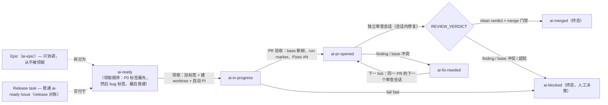

# 工作流

一个 Muyan Pilot 任务是一个 runtime outcome：当 X，应该 Y，实际 Z。
任务从一个 GitHub Issue 开始，以一个已合并的 PR 结束（或一个需要人工
的 `ai-blocked` 现场）。这一页覆盖完整的自动链路和项目的 GitHub 工作流
词汇。

## 完整链路

状态机（六个交付状态；review/fix 循环留在同一个 PR 上——只有它的 head
可以前进）：



```text
ai-ready                任务被派发（muyan_pilot.py add，或人工加标签）
  -> ai-in-progress     Runner 领取：加标签，从冻结的 origin/<base> SHA
                        创建 worktree，启动 Pi session
  -> ai-pr-opened       PR 验收通过（base 新鲜度、run marker、Fixes #N）；
                        交付现在等待 review
  -> review             独立 Pi session 审查精确的 base/head SHA，并
                        在会话内修复 findings（代码、完整测试、100%
                        覆盖率、只 push task branch），然后输出
                        REVIEW_VERDICT
  -> ai-fix-needed      会话内未能修复 finding，或 PR 落后最新 base /
                        有 merge conflict：下一个 tick 在同一 run、
                        同一 branch、同一 PR 上启动下一个审查会话
  -> merge              clean verdict + merge 门禁（head 包含最新 base、
                        PR mergeable、远端 head 未变）
  -> ai-merged          成功终态；PR body 的 Fixes #N 原生关闭 Issue
```

任何一点失败都 fail fast：Issue 被标记 `ai-blocked` 并留下具体现场
（命令、返回码、stdout/stderr、branch、worktree、session 文件），自动
循环从此不再碰它——人工决定下一步。

链路规则：

- 一个任务 = 一个 run = 一个 feature branch = 一个 worktree = 一个 PR。
  review/fix 循环期间 PR 编号永远不变；只有它的 head 可以前进。
- 只有两个 opened-PR 状态会被自动拾取：`ai-pr-opened`（等待 review）
  和 `ai-fix-needed`（等待下一个审查会话）。`ai-ready` 作为新工作被
  领取；`ai-blocked` 从不自动恢复。
- review/fix 循环有界（5 轮）。超轮仍有 findings，或 review 无法验证，
  Issue 标记 `ai-blocked`；PR、branch 和 worktree 原样保留。
- base 前进由 task branch 上对最新 `origin/<base>` 的普通 `git merge`
  吸收（冲突手工解决），然后重跑完整测试。不 force push、不自动解决
  冲突、不 push 保护分支。
- Git transport（Issue #114）：git 数据操作（fetch、push——包括
  `.github/workflows/*.yml`）走 SSH（`git@github.com:owner/repo.git`）；
  GitHub API 操作（Issue、PR、label、comment、merge）留在 `gh` token 上。
  任务 worktree 继承部署 checkout 的单一 `origin` remote，所以新
  bootstrap worktree 天然有 SSH `git remote -v`；传输损坏会让启动前
  检查失败（没有 HTTPS 回退）。

## 交付标签

GitHub 标签是外部状态机。它们不是 commit 创建的——每个仓库要初始化
（见[快速开始](/zh/getting-started)）：

| 标签 | 含义 |
|---|---|
| `ai-ready` | 明确派发给 Pilot；可以被领取 |
| `ai-in-progress` | 已领取、正在执行（被杀后的残留由下一 tick 接回） |
| `ai-pr-opened` | PR 已创建并验收；等待独立审查 |
| `ai-fix-needed` | PR head 尚不可合并；下一 tick 在同一 PR 上运行下一个审查会话 |
| `ai-merged` | 成功终态；Runner 已合并 PR 并确认 merge commit 落在保护分支 |
| `ai-blocked` | Runner fail fast；人工必须决定下一步 |

## Run marker 与 run_id

每个任务 attempt 生成一个 `run_id`（8 位 hex，例如 `e07383c2`），该
attempt 的每一步复用同一个值；同一 Issue 的 retry 生成新的。同一个 id
出现在：

- 该 attempt 的每条 journal 行（前缀 `[e07383c2]`）；
- Issue/PR 评论：可见字段 `run_id=e07383c2` + 隐藏机器可读 marker
  `<!-- muyan-pilot:run=e07383c2 -->`；
- feature branch 和 worktree 名（`.worktrees/<...>-issue-<n>-e07383c2`）；
- PR body——稳定 marker `<!-- muyan-pilot:run=e07383c2 -->` 是 PR 契约
  的一部分；Runner 拒绝没有它的 PR。

一条 grep 还原完整时间线：

```bash
journalctl --user -u muyan-pilot.service | grep e07383c2
gh search issues "e07383c2" --repo OWNER/PILOT-REPO
```

## PR body 契约：`Fixes #N`

PR 描述必须包含 `Fixes #<issue-number>`（可以放在首行）。GitHub 读的是
body（不是 PR title），PR merge 到默认分支时原生关闭 Issue。Runner 在
PR 验收时校验该关键词，缺失即 fail fast。

## Epic、Release task 与 P0 优先级

项目用普通 GitHub 原语组织多任务工作——没有 DAG、没有优先级数字、没有
独立队列：

- **Epic**：协调 Issue，把一组相关任务归在一起（例如 v0.1 release
  checklist）。它带 `ai-epic` 标签。Epic 本身不是可直接执行的任务：
  实际工作拆成独立的 `ai-ready` Issue，每个一个 runtime outcome、一个
  PR、一次 review、一次 merge。只有当子 Issue 完成且 release 证据
  （tag、已合并 PR）在远端存在后 Epic 才关闭——通常伴随最后一个
  `Fixes #<epic>` commit/PR。
- **Release task**：一个普通 `ai-ready` Issue，职责是 release 对账——
  检查子 Issue 已合并、版本 tag 在远端存在、release 证据完整。和任何
  任务一样通过一个 PR 交付（或当证据已在远端时直接关闭 Epic）。
- **P0 优先级**：普通 `p0` GitHub 标签标记紧急 Issue（生产故障）。它
  **不是**交付状态——只决定 ready 领取顺序，从不改变 Issue 粒度、任何
  交付状态或终态语义，Runner 也从不增删它。ready 领取顺序固定：
  `ai-ready`+`p0` → `ai-ready`+`bug` → 普通 `ai-ready`（三次
  `gh issue list` 扫描，共享完全相同的排除条件和 blockedBy 语义）。
  P0 遵守所有现有排除规则和单 slot 约束：被阻塞的 P0 被跳过（回退到
  bug/普通扫描），在途的 P0 由重启扫描接回。P0 运行失败单独进入
  `ai-blocked`（领取标签被移除；`ai-ready` 残留被所有 ready 扫描排除），
  所以没有任何 tick 重新领取——没有无限重试。没有优先级数字或加权队列。

Issue 之间的任务依赖用 GitHub 原生 `blockedBy` 关系（`gh issue edit N
--add-blocked-by M`）；Runner 读该字段并跳过有未关闭 blocker 的 Issue。
Issue body 里的 `Depends on #N` 行不被解析。
