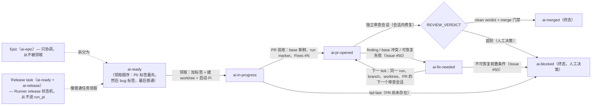

# 工作流

一个 Orbi 任务是一个 runtime outcome：当 X，应该 Y，实际 Z。
任务从一个 GitHub Issue 开始，以一个已合并的 PR 结束（或一个需要人工
的 `ai-blocked` 现场）。这一页覆盖完整的自动链路和项目的 GitHub 工作流
词汇。

## 完整链路

状态机（六个交付状态；review/fix 循环留在同一个 PR 上——只有它的 head
可以前进）：



```text
ai-ready                任务被派发（orbi add，或人工加标签）
  -> ai-in-progress     Runner 领取：加标签，从冻结的 origin/<base> SHA
                        创建 worktree，启动 Pi session（prompt 携带
                        Issue body 加受信任评论时间线 {{ISSUE_COMMENTS}}，
                        Issue #745：只收 OWNER/MAINTAINER/MEMBER/
                        COLLABORATOR 评论，按 issue_comments_limit 截断
                        并显式标明省略条数）
  -> ai-pr-opened       PR 验收通过（base 新鲜度、run marker、Fixes #N）；
                        交付现在等待 review
  -> review             独立 Pi session 审查精确的 base/head SHA，并
                        在会话内修复 findings（代码、完整测试、分层
                        覆盖率门禁（Issue #234）、只 push task
                        branch），然后输出 REVIEW_VERDICT（其 prompt
                        同样携带关联 Issue 的受信任评论时间线——决策
                        演变历史，Issue #745）
  -> ai-fix-needed      会话内未能修复 finding，PR 落后最新 base / 有
                        merge conflict，或已有 run/PR 的**可恢复失败**
                        （Issue #50：Pi 执行失败、验证失败、未推送本地
                        commit、worktree 缺失）：失败 comment 写入 Issue
                        和 PR，带完整现场（run_id、PR、branch、worktree、
                        session、phase、last activity、具体错误）；下一
                        个 tick 在同一 run_id、branch、worktree、PR 上
                        启动下一个审查会话
  -> merge              clean verdict（其 head 字段等于 PR head，
                        Issue #591）+ merge 门禁（head 包含最新 base、
                        PR mergeable、远端 head 未变）
  -> ai-merged          成功终态；PR body 的 Fixes #N 原生关闭 Issue
```

已有 run/PR 的失败被分类（Issue #50）：**可恢复失败**（Pi 执行失败、
验证失败、未推送本地 commit、worktree 缺失、会话内未能修复的 finding）
留在自动修复循环——Issue 标记 `ai-fix-needed`，失败 comment 写入 Issue
和 PR（带完整现场），下一个 tick 在同一 run、branch、worktree、PR 上
继续（不重新创建 PR、不重复领取）。只有 **AI 无法安全判断或修复的外部
前置条件**（无可恢复现场、base 分支变更、审查超轮、PR 未合并被关闭）
才 fail fast：Issue 被标记 `ai-blocked` 并写明为什么不能自动恢复，自动
循环从此不再碰它——人工决定下一步。

链路规则：

- 一个任务 = 一个 run = 一个 feature branch = 一个 worktree = 一个 PR。
  review/fix 循环期间 PR 编号永远不变；只有它的 head 可以前进。
- 只有两个 opened-PR 状态会被自动拾取：`ai-pr-opened`（等待 review）
  和 `ai-fix-needed`（等待下一个审查会话）。`ai-ready` 作为新工作被
  领取；`ai-blocked` 从不自动恢复。携带回填的 `ai-in-progress` 标签的
  交付仍会被拾取（Issue #178：review 中被杀的 Runner 会留下该标签——
  正向的 opened-PR 限定已保证 implement 阶段的 Issue 不会匹配该扫描）。
- review/fix 循环有界（5 轮）。超轮仍有 findings 时 Issue 标记
  `ai-blocked`（超轮是人工决策）；可恢复失败（Issue #50）保持
  `ai-fix-needed`。无论哪种，PR、branch 和 worktree 原样保留。
- base 前进由 task branch 上对最新 `origin/<base>` 的普通 `git merge`
  吸收（冲突手工解决），然后重跑完整测试。不 force push、不自动解决
  冲突、不 push 保护分支。
- Git transport（Issue #114、#580）：git 数据操作走配置的传输方式
  （`git_transport`：默认 `ssh`——git over SSH——，或 `https` 走
  `gh` credential helper），GitHub API 操作留在
  `gh` token 上——完整的双通道边界与启动前检查见[运维](/zh/operations)；
  凭据见[安全](/zh/security)。

## 交付标签

GitHub 标签是外部状态机。它们不是 commit 创建的——每个仓库要初始化
（见[快速开始](/zh/getting-started)）：

| 标签 | 含义 |
|---|---|
| `ai-ready` | 明确派发给 Orbi；可以被领取 |
| `ai-in-progress` | 已领取、正在执行。resume opened-PR 交付时 Runner 先幂等回填该标签再继续（Issue #178）；被杀后的残留由下一 tick 接回 |
| `ai-pr-opened` | PR 已创建并验收；等待独立审查 |
| `ai-fix-needed` | PR head 尚不可合并，或已有 run/PR 的可恢复失败（Issue #50）；下一 tick 在同一 run、branch、worktree、PR 上继续 |
| `ai-merged` | 成功终态；Runner 已合并 PR 并确认 merge commit 落在保护分支 |
| `ai-blocked` | 只用于 AI 无法安全判断或修复的外部前置条件（Issue #50）；blocked comment 写明为什么不能自动恢复；人工必须决定下一步 |

## 票派发：content、dev、ops

`ai-ready` 是所有任务类型的执行开关；第二个标签选择类型（Issue
#537）。共三类——派发时每个 Issue 选定其一：

| 票类型 | 标签 | Runner 做什么 |
|---|---|---|
| dev（默认） | `ai-ready` | 完整交付链：worktree、开发剧本、一个 PR、独立审查、合并 |
| ops | `ai-ready` + `ai-ops-only` | 同一个完整执行会话（worktree、shell、网络——实现里不存在任何命令白名单），但用 ops 剧本替代开发剧本。交付物 = 回到票上的证据；会话若附带代码 commit，则照常走 PR 流程 |
| content | `ai-ready` + `ai-content-only` | 内容代理：文本进、文本出，以 Issue 评论交付——无执行、无 git；交付后关闭 Issue |

ops 语义（Issue #537）：

- **信任边界是（凭据，票面）——不是命令白名单。** 会话原样获得 runner
  的全部环境（gh 凭据、`CLOUDFLARE_API_TOKEN`、AWS keys 等，外加
  deploy home 的 `.orbi/env` 文件）；凭据给多宽是用户的决定，runner
  不做二次裁剪。
- **票面即授权。** 会话只执行票面写明的 ops 动作（合并哪个 PR、部署
  哪个环境）；票面之外的动作回帖说明并停。人工审批门（environment
  approval、Release 批准）不由会话代行——这是提示词约定，不是执法代码。
- **交付 = 证据**（Issue #526 的事实文化）：每一步把真实命令与真实
  输出 / API 返回原文贴到票上；未执行的步骤如实标注未执行。纯 ops 运行
  （无 commit）以 Runner 关闭 Issue 并摘除 `ai-in-progress` 收尾——
  无 PR。附带代码 commit 则照常走 PR 路径（审查 + 合并）。

Issue #537 之前，`ai-ops-only` 标签派发的是内容代理（#530 只改了名，
模式未变——名字承诺 ops，模式仍是纯内容）；现在 content 路径派发到
`ai-content-only`，`ai-ops-only` 是完整执行的 ops 路径。

## Run marker 与 run_id

每个任务 attempt 生成一个 `run_id`（8 位 hex，例如 `e07383c2`），该
attempt 的每一步复用同一个值；同一 Issue 的 retry 生成新的。同一个 id
出现在：

- 该 attempt 的每条 journal 行（前缀 `[e07383c2]`）；
- Issue/PR 评论：可见字段 `run_id=e07383c2` + 隐藏机器可读 marker
  `<!-- orbi:run=e07383c2 -->`；
- 里程碑与场景评论还携带隐藏的 runner marker `<!-- runner=1a2b3c4d -->`：
  写出评论的部署指纹——执行 checkout 的 HEAD；非 editable 安装为包版本；
  探测失败为 `unknown`（live progress 评论与 PR 评论不带它）；
- 稳定的按 Issue 命名的 feature branch（`orbi/<owner>-<repo>-issue-<N>`）；
- worktree 名（`.worktrees/orbi-<owner>-<repo>-issue-<n>-e07383c2`），以及 Pi
  session 目录和 run 产物；
- PR body——稳定 marker `<!-- orbi:run=e07383c2 -->` 是 PR 契约
  的一部分；Runner 拒绝没有它的 PR。

一条 grep 还原完整时间线：

```bash
journalctl --user -u orbi@1.service -u orbi@2.service | grep e07383c2
gh search issues "e07383c2" --repo OWNER/PILOT-REPO
```

## PR body 契约：`Fixes #N`

PR 描述必须包含 `Fixes #<issue-number>`（可以放在首行）。GitHub 读的是
body（不是 PR title），PR merge 到默认分支时原生关闭 Issue。Runner 在
PR 验收时校验该关键词，缺失即 fail fast。

## Epic、Release task 与 P0 优先级

项目用普通 GitHub 原语组织多任务工作——没有 DAG、没有优先级数字、没有
独立队列：

- **Epic**：协调 Issue，把一组相关任务归在一起（例如 v0.1 release
  checklist）。它带 `ai-epic` 标签。Epic 本身不是可直接执行的任务：
  实际工作拆成独立的 `ai-ready` Issue，每个一个 runtime outcome、一个
  PR、一次 review、一次 merge。Runner **从不领取** Epic（Issue #93）：
  普通领取扫描跳过它并记录结构化日志
  `epic_not_claimed issue=N repo=...`（不领取、不改标签、不建 worktree、
  不启动 run、不占 slot），重启恢复扫描也排除它。Epic 的子票声明唯一
  来源是 GitHub 原生 `sub-issues` 关系：所有子 Issue 必须 CLOSED（或其
  PR 已 merged），且没有 open 的原生 `blockedBy`。正文中的引用（包括
  `Children`/`Child Issues` 段落）不构成声明。没有 sub-issues 或子票、依赖
  状态畸形时 fail-closed；Runner 每个 tick 重试并留下幂等审计评论。随后
  同一个 tick reconcile open Milestone：title 精确匹配的已发布 Release
  （draft 不算）且当前没有 open Issue 才关闭，其余情况保持 open。最后
  同一个 tick 还会扫一遍 open PR（Issue #746）：head 为稳定交付命名
  （`orbi/<repo>-issue-<N>`）且源票已被人工关闭的 PR，会在 PR 上收到
  一条幂等的报告评论——所有 resumable 扫描都只查 `state=open` 的票，没有
  这个扫描该 PR 会永久悬空。合并/关闭由人决定：Runner 绝不自动合，
  也绝不越过人的关闭决定去自动关。
- **Release task**：带 `ai-release` 标签的 `ai-ready` Issue（Issue
  #98）。它**不是**开发任务：Runner 通过普通 ready 扫描领取，但
  `process_issue` 把它路由到确定性的 release 状态机而不是 `run_pi`——
  没有 Pi 会话、没有 PR。状态机幂等且可恢复（重启后恢复同一
  run id/worktree），按顺序执行这些步骤：

  1. 严格解析 Issue 正文的 `## Release` 声明：`version`、
     `base_branch`、`scope`（`#N` 列表）或 `scope_from_milestone`，
     以及可选的 `version_file`（默认 `pyproject.toml`，也可为
     `package.json` 或 `none`）。声明不携带任何本地测试契约
     （Issue #569）：测试验收就是 release commit 的 GitHub Actions
     CI 结果（#268 CI-wait 门）。旧票面若仍声明 `test_command`，
     接受但忽略（记一行 evidence），永不执行。字段缺失、重复或未知
     都 fail fast。
  2. 冻结 base——release commit 就是 `origin/<base_branch>`（在
     base-sync 锁下 fetch）。在任何门禁等待之前，校验声明（或默认）
     的 `version_file` 确实存在于该冻结树的根目录（Issue #740）：
     不匹配在认领瞬间 fail fast，错误信息列出根目录实际存在的受支持
     文件和 `none` 选项，不会在烧完门禁和范围核验后才以
     FileNotFoundError 失败。
  3. 执行发布前门禁：**release 所属 Milestone 内**无遗留 open 的
     `ai-in-progress` / `ai-pr-opened` / `ai-fix-needed` Issue
     （Issue #671；release Issue 本身除外；无 Milestone 时仍按全仓
     扫描）、
     release commit 的 CI 全绿（no check runs passes 带明确证据；
     pending check 是中间态——门禁等待最终结论，每次轮询一条
     `release_waiting_ci` journal 行和一次进度评论更新，上限
     `release_ci_wait_seconds`（默认 1800 秒）；等待超时以独立原因
     失败，绝不报成 CI 失败）。open PR 刻意不是门禁（Issue #608，
     维护者裁决）：open PR 是队列状态，不是发布前提——是否存在 open
     PR、多少个、谁提的，与发版无关；滞留 PR 由交付循环自身的
     接管/对账机制处理。因真实 `gh` 失败而查不了的门禁算失败门禁。
  4. 逐项验证 scope：`gh pr view` 必须报告 `MERGED`，否则
     `gh issue view` 必须报告 `CLOSED` 且 `stateReason` 为
     `COMPLETED`——`NOT_PLANNED` 关闭（重复/不做）的票在 Scope 证据里
     标注为排除、绝不进入 Changelog，Changelog 的 PR 链接只在 PR 已
     合并时才写入（Issue #707）。禁止解析复选框——每个 scope
     项都对照 live API 检查。
  5. 测试验收就是 release commit 的 CI-wait 门：版本 bump 之后，门禁会对
     该 commit 重跑（步骤 3 的 `release_ci_wait_seconds` 等待），CI 红或
     等待超时走既有可恢复失败路径（`ai-blocked`）。没有本地测试执行
     （Issue #569）——release 流程即 bump → push → CI-wait → tag。
     如果 CI 红或等待超时，既有失败路径会阻止发布；版本 bump 可以保留在
     `main`，这是可接受的终态。bump 是幂等的，修复 CI 后重试 release
     会安全地再次准备所请求的版本。
  6. 打 tag：远端 tag 不存在时，在 release commit 上创建 annotated
     tag 并普通 push（绝不 `--force`）。已存在时必须精确指向 release
     commit——不匹配 fail fast。已存在的 tag 绝不移动、覆盖或
     force-push。
  7. 发布 GitHub Release（幂等），notes 带完整验证证据：version、
     tag、release commit、逐项 scope 证据、门禁证据、测试证据和 run
     marker。
  8. 同步文档站 Release notes（Issue #275）——在 GitHub Release 发布
     之后、关闭 Milestone 之前：用已发布的 Release body 生成
     `docs/release-<version>.mdx` 与 `docs/zh/release-<version>.mdx`
     （不重复实现 changelog 生成——#204 已完成那部分），补上现有
     release 页共有的元信息：tag/release commit 对应关系、发布时间、
     release task 的 Issue 编号；在 `docs/docs.json` 的 `Releases`/
     `发布` 导航分组首位插入新版本（中英文两处，最新在前）；把
     `(latest)` 标题标记从上一版页面转移到新版本页面（只有最新页面
     带该标记）。这些文件改动直接提交进 base 分支（release 路径无
     PR）并普通 push。幂等：已有页面内容一致时不重复生成、不覆盖，
     无改动时不提交；已有页面内容不一致则 fail fast。任何失败都让
     整个 release 失败（`ai-blocked`），绝不静默跳过。
  9. 给 release Issue 打上 `ai-merged` 并关闭它（交付终态转换）。
  10. 关闭 title 与发布 version 精确一致的 Milestone（Issue #214），
      然后写成功评论（release URL、tag、commit、证据、文档站 Release
      notes 证据、Milestone 证据）。只按 title 精确匹配（不猜测、不
      模糊匹配、绝不关别的 Milestone）：0 个 open Issue 时关闭；已关闭
      是幂等成功（不重开）；Milestone 缺失或仍有 open Issue 则 fail
      fast，带上 version、Milestone 编号/链接和 open issue 列表（绝不
      静默跳过）。任何失败：单独进入 `ai-blocked`（release 是人工决策
      点——不自动重试），失败评论带 run marker 和具体原因，异常向上传
      播让 tick fail fast。

  `ai-release` 标签是类型标记，**不是**交付状态：它不属于交付状态机、
  不是 ready 扫描的排除条件，Runner 从不增删它——只有人在派发时
  （与 `ai-ready` 一起）添加。
- **P0 优先级**：普通 `p0` GitHub 标签标记紧急 Issue（生产故障）。它
  **不是**交付状态——只决定 ready 领取顺序，从不改变 Issue 粒度、任何
  交付状态或终态语义，Runner 也从不增删它。ready 领取顺序固定：
  `ai-ready`+`p0` → `ai-ready`+`bug` → 普通 `ai-ready`（三次
  `gh issue list` 扫描，共享完全相同的排除条件和 blockedBy 语义）。
  P0 遵守所有现有排除规则和单 slot 约束：被阻塞的 P0 被跳过（回退到
  bug/普通扫描），在途的 P0 由重启扫描接回。P0 运行失败单独进入
  `ai-blocked`（领取标签被移除；`ai-ready` 残留被所有 ready 扫描排除），
  所以没有任何 tick 重新领取——没有无限重试。没有优先级数字或加权队列。

Issue 之间的任务依赖用 GitHub 原生 `blockedBy` 关系（`gh issue edit N
--add-blocked-by M`）；Runner 读该字段并跳过有未关闭 blocker 的 Issue。
Issue body 里的 `Depends on #N` 行不被解析。

## 仓库级交付策略（`.github/orbi.toml`）

仓库可以把**交付策略**作为代码版本化。claim 时 Runner 通过 GitHub
contents API 读取仓库**默认分支 tip** 上的 `.github/orbi.toml`——
绝不读任务分支、绝不读本地 worktree——并按**按键分域**把白名单键应用
到宿主 `orbi.toml` 之上。没有该文件的仓库行为与之前完全一致（零变化）。
位置固定，只有文件名可用 `[[repositories]]` 条目的可选字段
`config_path`（默认 `.github/orbi.toml`）覆盖。

只允许交付策略键：

| 键 | 类型 | 含义 |
| --- | --- | --- |
| `base_branch` | string | 该仓库的交付 base 分支；缺席时回退到匹配的 `[[repositories]].base_branch`，否则回退宿主 `base_branch`。 |
| `active_milestone` | string | 该仓库 fresh claim 的 Milestone 范围。 |
| `test_command` | string | 该仓库的测试命令，注入实现者 prompt。 |
| `context_files` | string[] | 仓库内相对路径的上下文文件；注入前校验存在性与大小上限。 |
| `dispatch_label` | string | 该仓库的认领标签（默认 `ai-ready`）；交付生命周期标签恒为宿主常量。 |

```toml
# .github/orbi.toml
base_branch = "beta"
active_milestone = "v0.5.0"
test_command = "pytest -q"
context_files = ["AGENTS.md"]
```

其他键一律拒绝：未知键、host-only 身份/安全键（见
[安全](/zh/security)）、坏 TOML 或类型错误都会让 claim fail-fast 并
在错误里列出违规键，Issue 进入 `ai-blocked`——一个仓库的坏文件绝不
影响其他池。`dispatch_label` 不得是交付生命周期标签
（`ai-in-progress`、`ai-merged` 等）：那些恒为宿主常量。阻塞落在
claim 选中的那个 Issue 上；`dispatch_label` 不是 `ai-ready` 的仓库在
文件本身坏掉时没有 `ai-ready` 候选 Issue 可阻塞，此时 fail-fast 原因
只在 journal 的 `repo_config_invalid` 行（不改标签、不发评论）。run 评论记录
`repo_config: <sha>`；与上一 run 的 sha 不同时附 `repo_config_changed`
标注，且当前一版内容可读时附有效键值 diff `repo_config_diff`，让变更
始终在 run 上可见。传输原因（限流、网络）导致的读取失败只记一行
`repo_config_read_failed` 并回退宿主配置——该降级在 run 评论上表现为
缺少 `repo_config` 字段。
